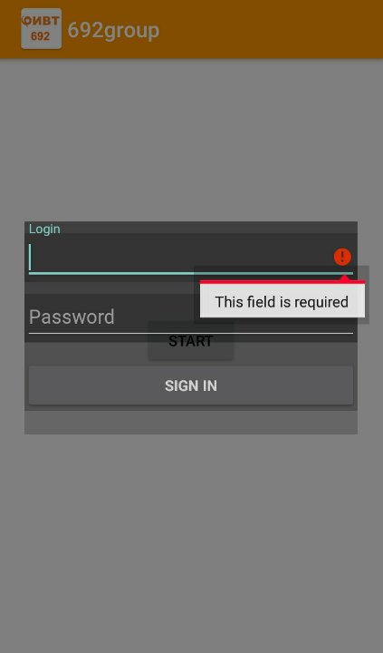

# 692gropup
## Приложение для рассылки личных сообщений от имени группы ВК. 
В связи с тем, что уведомления в общих чатах можно отключать, было придумано данное решение.\
Используются API ВК и базы данных SQLite.\
Реализована возможность просмотра базы данных, выбор списка рассылок.

[1.0.0 base]\
add base application: MainActivity, InfoActivity with VkApi and SQL Data base

[1.0.1 new_year]\
update design and functionality of MainActivity for new_year

[1.0.2 new_year]\
add LoginActivity

  

